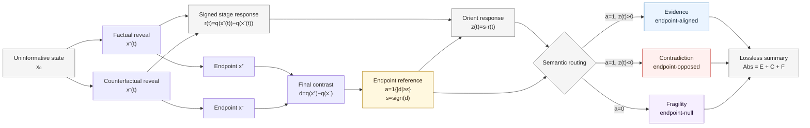

<div align="center">

# DECAF

### Decomposition of Evidence, Contradiction, and Fragility in Perturbation Responses

[](LICENSE)
[](https://arxiv.org/abs/2608.12935)
[](https://www.python.org/)

**Response magnitude tells you how much a model reacts. DECAF tells you what kind of response produced it.**

[Paper](https://arxiv.org/abs/2608.12935) · [Quick start](#quick-start) · [How it works](#decaf-at-a-glance) · [Reproduce the paper](#reproduce-the-paper)

</div>

<!-- Add a PyPI badge and `pip install ...` command after the first public package release. -->
<!-- Add an online-demo badge/link here once a public demo is available. -->

---

## What is DECAF?

Perturbation and counterfactual methods often reduce a model response to one number: **how much the prediction changed**.

That magnitude can hide very different behavior. The same response size may:

- support the model's final factual–counterfactual difference;
- oppose that final difference;
- become large along the perturbation path even though the final endpoints differ very little.

**DECAF** resolves this ambiguity by decomposing a paired perturbation response into three nonnegative components:

| Component | Meaning |
|---|---|
| **Evidence — `E`** | Response aligned with the final factual–counterfactual effect |
| **Contradiction — `C`** | Response opposed to the final effect |
| **Fragility — `F`** | Response along the path when the final endpoint effect is negligible |

The decomposition is lossless:

$$
\mathrm{Abs} = E + C + F.
$$

So DECAF does not discard ordinary response magnitude. It **refines** it.

---

## DECAF at a glance



For a scalar model score \(q\), paired reveal trajectories \(x^+(t)\) and \(x^-(t)\) produce

$$
r(t)=q(x^+(t))-q(x^-(t)),
\qquad
d=r(1).
$$

With a practical endpoint threshold \(\varepsilon>0\),

$$
a=\mathbf{1}\{|d|\geq\varepsilon\},
\qquad
s=\mathrm{sign}(d),
\qquad
z(t)=s\,r(t).
$$

DECAF routes the response as

$$
e(t)=a[z(t)]_+,
\qquad
c(t)=a[-z(t)]_+,
\qquad
f(t)=(1-a)|r(t)|.
$$

The finite-grid implementation then integrates these pointwise components over reveal stages.

---

## Why use DECAF?

DECAF is deliberately lightweight.

- **Forward-only.** No gradients, backward passes, or internal activations are required.
- **Model-agnostic.** It works with neural networks, tree ensembles, simulators, or remote score APIs.
- **Lossless.** Ordinary magnitude is recovered exactly as `Abs = E + C + F`.
- **Batch-friendly.** Examples, stages, factors, paths, repetitions, and models are independent batching dimensions.
- **No learned explainer.** DECAF does not require fitting a separate explanation model.
- **Protocol-explicit.** The factual–counterfactual pair, reveal path, score, stage measure, and endpoint threshold remain explicit.

DECAF begins **after** a paired intervention has been specified. It does not choose the counterfactual or reveal path for you.

---

## Quick start

### 1. Install from source

A PyPI release is not available yet.

```bash
git clone https://github.com/youlei202/decaf.git
cd decaf
uv sync
```

Python 3.11 or newer is recommended.

### 2. Decompose paired score trajectories

```python
import numpy as np

from decaf.core import trajectory_scores

# Reveal stages from a common uninformative state to the clean endpoints.
t = np.array([0.00, 0.25, 0.50, 0.75, 1.00])

# Rows are paired examples; columns are reveal stages.
q_plus = np.array(
    [
        [0.50, 0.55, 0.65, 0.75, 0.900],
        [0.50, 0.40, 0.35, 0.60, 0.800],
        [0.50, 0.70, 0.40, 0.65, 0.505],
    ]
)

q_minus = np.array(
    [
        [0.50, 0.45, 0.40, 0.35, 0.400],
        [0.50, 0.60, 0.65, 0.50, 0.400],
        [0.50, 0.40, 0.60, 0.40, 0.495],
    ]
)

result = trajectory_scores(
    grid=t,
    response=q_plus - q_minus,
    epsilon=0.02,
)

for name in ("M", "E", "C", "F", "Abs"):
    print(name, np.round(result[name], 4))

assert result["numeric_audit"]["passed"]
```

The three rows illustrate an evidence-dominant response, a response containing contradiction, and an endpoint-null fragile response.

### 3. Connect DECAF to your own model

The model-facing part is small: evaluate the **same scalar score** on matched factual and counterfactual branches at every reveal stage.

```python
plus_scores = []
minus_scores = []

for x_plus_t, x_minus_t in paired_path:
    plus_scores.append(score(model(x_plus_t)))
    minus_scores.append(score(model(x_minus_t)))

q_plus = np.stack(plus_scores, axis=-1)
q_minus = np.stack(minus_scores, axis=-1)

result = trajectory_scores(
    grid=stage_positions,
    response=q_plus - q_minus,
    epsilon=epsilon,
)
```

For stochastic models or stochastic reveal protocols, factual and counterfactual branches should share randomness whenever possible.

---

## What DECAF requires

A DECAF analysis needs four ingredients:

1. **Score** — a scalar model score \(q\);
2. **Pair** — a meaningful factual–counterfactual pair \((x^+,x^-)\);
3. **Path** — matched reveal trajectories \(x^+(t)\) and \(x^-(t)\);
4. **Threshold** — an endpoint threshold \(\varepsilon\) on the same scale as the score.

Examples of valid scores include:

- probabilities;
- logits;
- margins;
- regression values;
- rewards or action values;
- any stable real-valued black-box score.

Hard labels are formally sufficient, but richer real-valued scores are usually more informative.

---

## Interpreting the output

`trajectory_scores(...)` returns per-example endpoint and trajectory summaries.

| Field | Meaning |
|---|---|
| `M` | Clean endpoint magnitude \(|d|\) |
| `E` | Integrated endpoint-aligned evidence |
| `C` | Integrated endpoint-opposed contradiction |
| `F` | Integrated endpoint-null fragility |
| `Abs` | Integrated ordinary magnitude |
| `Net` | Oriented signed mass, `E - C` |
| `signed_E` | Evidence restored to the endpoint score direction |
| `endpoint_delta` | Signed endpoint contrast \(d\) |
| `endpoint_active` | Whether \(|d| \ge \varepsilon\) |
| `pointwise_components` | Stage-wise DECAF routing |
| `numeric_audit` | Pointwise and integrated conservation checks |

The core package also exposes lower-level utilities for pointwise decomposition, finite-grid integration, streaming accumulation, bootstrap summaries, and reproducibility audits.

---

## Choosing the endpoint threshold

The threshold \(\varepsilon\) is **not universal**.

The paper uses \(\varepsilon=0.02\) for true-class probabilities in the main ImageNet-9 analysis. Other score spaces generally require different numerical thresholds.

We recommend reporting:

- the score definition and direction;
- the chosen threshold;
- the endpoint-active fraction;
- a small threshold-sensitivity sweep when branch membership matters.

If the score is positively rescaled, the threshold should be rescaled by the same factor to preserve gate membership.

---

## Highlights from the paper

DECAF is evaluated across controlled vision, natural images, tabular models, external attribution benchmarks, and a large vision transformer.

- **Same magnitude, different semantics.**  
  In a 72-model ImageNet-9 audit with nearly matched ordinary response magnitude, DECAF's dominant component agrees with independently observed behavior in **96.4%** of cases, compared with **35.0%** for magnitude alone.

- **Reveal-path diagnostics.**  
  Changing only the reveal path increases total response by nearly **80%**, while evidence changes little and fragility grows by more than **4×**.

- **Forward-only scaling.**  
  On a 1B-scale DINOv2 model, a short DECAF trajectory matches a strong gradient-based baseline while using **4.75× lower wall time** and **2.36× lower peak memory**.

- **Cross-model behavioral validation.**  
  Evidence, contradiction, and fragility track independently measured preservation, inversion, and endpoint-null sensitivity across neural, linear, and tree-based models.

Read the paper for the complete experimental protocols, baselines, statistical tests, and boundary cases:

**[arXiv:2608.12935](https://arxiv.org/abs/2608.12935)**

---

## Reproduce the paper

The repository contains four experiment families:

- controlled 3D Shapes mechanisms;
- ImageNet-9 paired-background audits;
- attribution benchmarks on FunnyBirds, ImageNet-1k, PartImageNet, and DINOv2;
- the Covertype tabular benchmark.

Install all experiment dependencies and run the CPU verification suite:

```bash
uv sync --all-extras
bash scripts/reproduce/verify.sh --mode unit
```

Reference-run replay uses four explicit roots:

```bash
export DECAF_DATA_ROOT=/path/to/datasets
export DECAF_CACHE_ROOT=/path/to/cache
export DECAF_RESULTS_ROOT=/path/to/results
export DECAF_REFERENCE_RUNS_ROOT=/path/to/sealed/reference/runs
```

Replay the stored analysis and regenerate paper assets:

```bash
bash scripts/reproduce/controlled.sh \
  --stage analyze --profile paper --output runs/controlled/replay

bash scripts/reproduce/imagenet9.sh \
  --stage analyze --profile paper --output runs/imagenet9/replay

bash scripts/reproduce/attribution.sh \
  --stage analyze --profile paper --output runs/attribution/replay

bash scripts/reproduce/covertype.sh \
  --stage analyze --profile paper --output runs/covertype/replay

bash scripts/reproduce/paper.sh \
  --reference-runs "$DECAF_REFERENCE_RUNS_ROOT" \
  --output paper/generated

bash scripts/reproduce/verify.sh --mode analysis-replay
```

The stored analysis replay does not perform model inference. Full vision training and inference require the datasets and checkpoints described in the documentation, together with suitable GPU hardware.

---

## Documentation

- [Reproduction guide](docs/reproduction.md)
- [Datasets](docs/datasets.md)
- [Checkpoints](docs/checkpoints.md)
- [Hardware](docs/hardware.md)
- [Verification scope](docs/verification.md)
- [Result schema](docs/result_schema.md)

---

## Repository layout

```text
src/decaf/core/          Reusable DECAF decomposition and numerical primitives
src/decaf/experiments/   Controlled, ImageNet-9, attribution, and Covertype pipelines
src/decaf/paper/         Reference replay and paper-asset generation
configs/                 Smoke, integration, and paper experiment profiles
manifests/               Dataset, checkpoint, and reference-run contracts
scripts/reproduce/       Stable verification and reproduction entry points
docs/                    Data, hardware, schema, and reproduction documentation
tests/                   Unit, integration, and regression tests
paper/                   Visual manifests and generated-asset targets
```

---

## Development

```bash
uv sync --all-extras
uv run pytest
uv run ruff check .
```

The implementation promotes response arrays to `float64` before endpoint classification and identity checks. Tests cover conservation, endpoint-swap invariance, score scaling, finite-grid/streaming agreement, validation failures, experiment contracts, and paper replay.

---

## Citation

If you use DECAF in your work, please cite the arXiv version:

```bibtex
@article{you2026decaf,
  title   = {DECAF: Decomposition of Evidence, Contradiction, and Fragility in Perturbation Responses},
  author  = {You, Lei},
  journal = {arXiv preprint arXiv:2608.12935},
  year    = {2026},
  url     = {https://arxiv.org/abs/2608.12935}
}
```

---

## License

Released under the [MIT License](LICENSE).
